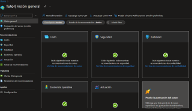
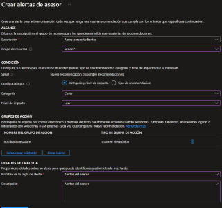
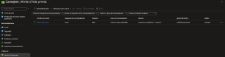

## Azure Advisor

Te recomienda cosas.

- **Modelo de servicio:** SaaS.
- **Funcion:** Para que te recomiende.
- **Caracteristicas:** Usa inteligencia Artificial.
- **Funcion:** Recomienda configuraciones para aumentar la seguridad, el rendimiento o bajar los costos.
- **Cuando usar:** Puede ayudar al cumplimiento y la eficiencia de la nube.

------------------------------------------------------------------------------------------------------------

### Pasos para crear una alarma de Azure Advisor

1.- Abrir el [Portal Azure](azure.portal.com)

1[Portal Azure](Imagenes/PortalAzure.PNG)

2.- Buscamos Advisor.

3.- Aca podremos que cosas estan bien o que cosas estan mal.

3.- Nos vamos a alerta y creamos una.

4.- Llenamos los datos, como nosotros queramos y le damos en crear.

5.- cuando se detecte los parametros que pusimos en la alerta de uso, nos llegara al correo

5.- Y listo.

Cuando advisor detecte un cambio o algo, nos ayuda a reducir costos, ser mas seguros, etc.

--------------------------------------------------------------------------------------------------------
